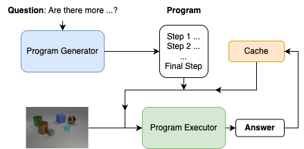
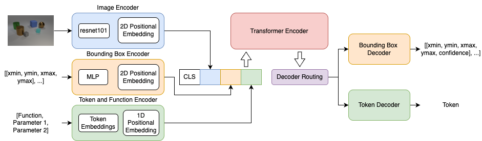
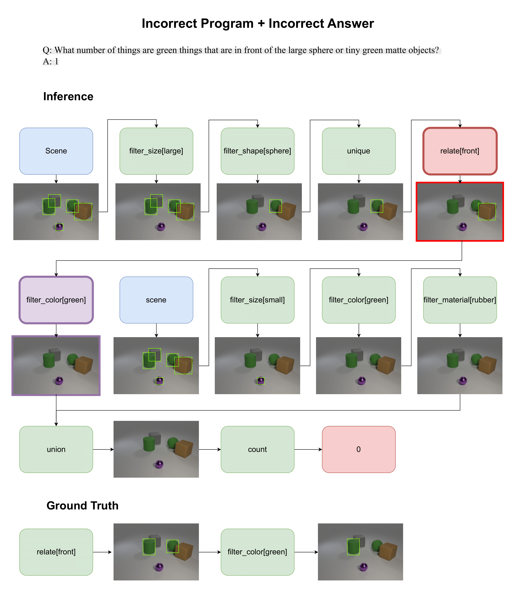

# Spatially Grounded Compositional Reasoning for Explainable Visual Question Answering

Many VQA models achieve high accuracy by exploiting statistical shortcuts rather than reasoning about the image content. For example, a model might answer "What colour is the sky?" as "blue" simply because blue skies are common in training data.  

Our approach ensures that the model **grounds each reasoning step in the image** using bounding boxes. This forces the model to "look" at the image during every step, rather than relying on biases or shortcuts.

## CLEVR Dataset & Programs

We use the [**CLEVR** dataset](https://github.com/facebookresearch/clevr-dataset-gen), a synthetic benchmark for compositional visual reasoning. Each image contains simple 3D objects with attributes such as shape, colour, size, and material. Questions come with **functional programs**, sequences of operations required to answer the question.  

*Example:*  
Image: Tiny cyan cube and large red sphere  
Question: "How many other objects have the same shape as the tiny cyan cube?"  
Program steps:  
1. `filter_shape[cube]` – select all cubes  
2. `filter_size[tiny]` – select tiny cubes  
3. `count` – count the resulting objects  

## Framework Overview

The framework consists of two main components: **Program Generator** and **Program Executor**. Programs generated from questions are fed step by step into the executor. During inference, intermediate inputs and outputs are saved and retrieved from an inference cache.  

  

### Program Generator
* Uses an **encoder-decoder architecture with attention** to predict the program sequence from a natural language question.  

### Program Executor
* Transformer-based model that processes three inputs: the image, the current function, and dependencies from previous steps.  
* Outputs are either **bounding boxes** (for object identification) or a **single token** (for logical or counting steps), depending on the current operation.  

  

## Example 

Example of incorrect program with incorrect answer: An error in the relate[front] function propagates through subsequent steps.
  

## 📊 Findings

* **Faithfulness**: Correct reasoning strongly correlate with correct answers (whereas incorrect reasoning strongly correlate with incorrect answers), much more so than in baseline models. This confirms that the model relies on reasoning paths and image content rather than shortcuts.  
* **Generalisation**: While overall accuracy does not match state-of-the-art models, our framework is more robust on CLEVR-CoGenT. In this dataset, colors are reassigned to different shapes in split B compared to split A, so models that rely on learned color-shape correlations perform worse. By forcing the model to visually ground each reasoning step, our framework avoids relying on these spurious correlations and generalizes better to novel combinations.

